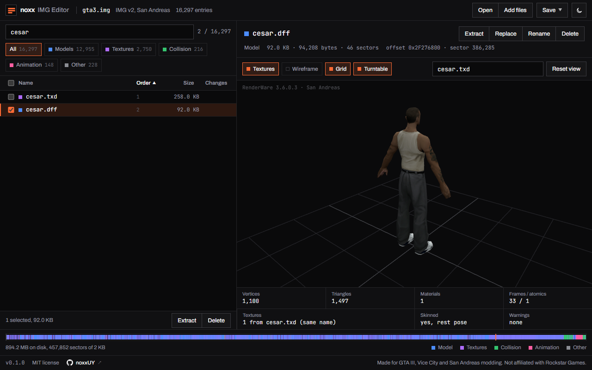
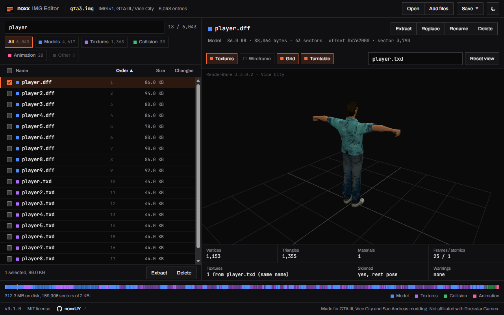
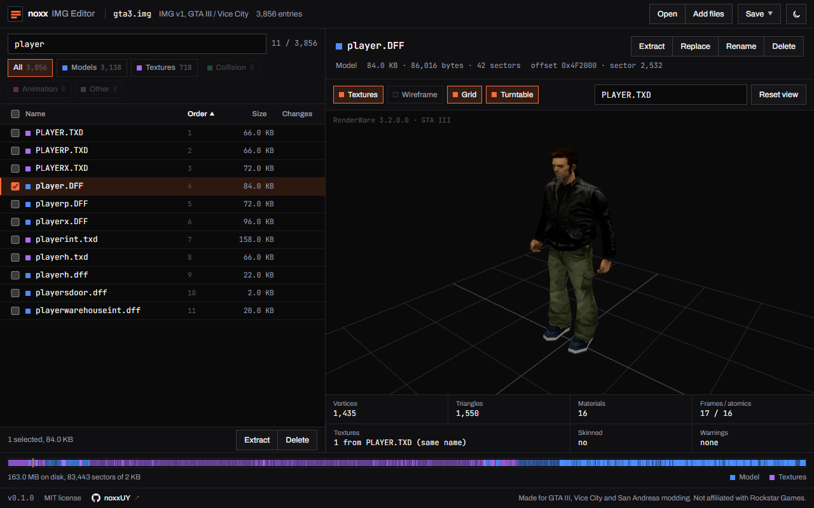

# noxx's IMG Editor

Browser-based IMG archive editor for the classic GTA trilogy with 3D model viewer and texture previewer. Nothing leaves your machine.





## Getting started

```bash
npm install
npm run dev
```

Drop `gta3.img` on the page. GTA III and Vice City archives use `.img` + `.dir` — drop both together.

## License

MIT
